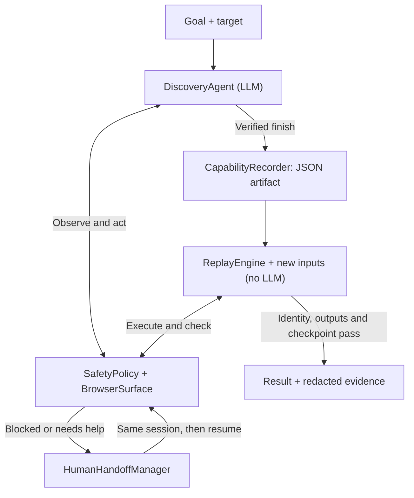

# BankPilot Design Report

BankPilot discovers a workflow in a mock banking UI, saves it as a reusable capability, and replays it with different inputs. The model chooses actions during discovery; replay checks the saved contract and never calls the model. The project focuses on browser execution, failure handling and a working human handoff.

## 1. Architecture

The main components are `DiscoveryAgent`, `BrowserSurface`, `SafetyPolicy`, `CapabilityRecorder`, `ReplayEngine`, `CapabilityRouter` and `HumanHandoffManager`.



Read the main path from top to bottom: discover a working flow, record it, then replay it with new inputs. Both phases use policy-checked browser actions. When handoff is enabled, the operator works in the paused run's browser; resuming still requires validation. A later replay starts its own session.

Discovery reads visible controls and page text, asks for one action, checks it against policy, then executes it. The model refers to an observed element ID rather than supplying code or selectors. Recorder code parameterizes the trace and builds the supported banking contracts. `main.py discover` accepts the goal and target; `replay` accepts the artifact and new inputs.

Python keeps validation and browser control in one process. Playwright's synchronous API makes session ownership straightforward: the same page stays alive across steps and handoffs. The trade-off is one blocked process per active run. Discovery uses OpenAI's Responses API with configurable `OPENAI_MODEL` (default `gpt-5.6-luna`). Each request makes a short, bounded decision; model cost and latency have not been benchmarked.

## 2. Artifact schema

Schema `1.1` contains identity/application metadata, typed inputs and outputs, ordered steps, targets and a success condition. This excerpt shows the caller-facing contract:

```json
{
  "schema_version": "1.1",
  "parameters": [{"name": "member_id", "type": "string", "required": true}],
  "outputs": [{"name": "savings_balance", "type": "string"}],
  "success_condition": {"type": "text_present", "value": "Balance Result"}
}
```

The [complete artifact](artifacts/lookup_savings_balance.json) includes the starting URL and executable steps. Runtime values use placeholders such as `{{member_id}}`; balances remain formatted strings. Pydantic validates types, unique names, targets, declared placeholders and output extraction mappings. Schema versioning is separate from the registry's capability release version.

Artifacts contain no raw model transcript. UI-derived metadata passes a privacy guard; detected unsafe locators are rejected for review. Unknown workflows receive a generic description and title checkpoint with no invented outputs. Their contract needs review before reuse.

## 3. Determinism & error handling

Replay resolves parameters and dispatches recorded actions without an LLM. It tries a unique role/accessibility-name target, then the saved CSS/XPath selector. Recording prefers stable attributes and uses positional XPath only as a fallback. Initial navigation uses `start_url`; the unused `navigate` enum is not an executable step. There is no automatic locator repair or separate text-anchor tier.

Success requires matching the requested member ID, extracting every declared output with the correct type, and satisfying the final text/title/URL checkpoint. A failed extraction is retried after handoff. Discovery also checks its final observation, although a generic title-only checkpoint is weaker than a reviewed business assertion.

Business outcomes such as `MEMBER_NOT_FOUND`, `ACCOUNT_LOCKED` and invalid input return structured results. Temporary target/application failures receive two retries by default; recovery is recorded in `recovered_steps`. Exhausted targets, identity mismatch and failed output/checkpoint checks return failures with context. Session/authentication, dialog and verification conditions request configured handoff or return a specific code. Permission denial stops without retry. These classifications rely on known UI markers.

## 4. Heterogeneity & multi-tenant

`Surface` defines observation, actions, targeting, extraction and evidence capture. Browser replay delegates those operations to `BrowserSurface`, which currently extracts labeled HTML table rows. Some discovery/handoff context still accesses Playwright directly. A desktop adapter would need OS accessibility identifiers, platform actions and an equivalent extraction method; `DesktopSurface` is unimplemented. `TerminalSurface` is a restricted no-shell helper, not a complete automation surface.

The proposed tenant model combines a base vendor capability, tenant configuration, application/version profile, locator overrides and tenant safety policy. If one institution changes “Search Member” to “Find Member,” a reviewed locator and click-policy override can preserve the business steps and contract. Overlays must not weaken platform restrictions.

The file registry already scopes entries by tenant/application and tracks draft/approved/retired state. Production overlay composition and compatibility checks are design work: bind versions to approval evidence, detect drift with canary runs/fingerprints, then stop for review, compatible rollback or re-recording. The current token-similarity router can miss valid paraphrases or select a wrong approved intent. Direct CLI replay does not go through registry approval.

## 5. Escalation & handoff

With handoff enabled, manual verification, selected blocked steps, explicit escalation, suspicious UI instructions and exhausted discovery budgets can pause automation. The manager retains the live browser and cookies, captures a masked screenshot, and records the capability, step, URL/title, reason and control owner.

The operator uses that browser and describes the intervention in the terminal. A blank note or unchanged page state cannot resume; `/cancel` terminates. Logs retain a safe `human_action_type` and redact free-form notes. The category describes the intervention context; it does not prove the operator's identity or exact clicks. Replay still checks outputs and final state. An exhausted discovery budget does not grant extra model calls or save an unfinished capability.

`python -m tests.test_handoff` exercises member `10025` and asserts one handoff. Runtime screenshots are generated locally. The retained historical log predates the structured audit category and is labeled accordingly in the evidence index.

## 6. Safety

Policy runs outside the model. Discovery and replay check the full origin (scheme, host and port), route, action and click target. Resolved links and HTML form destinations, including `formaction`, are checked before clicks. Financial commitment routes are blocked; the mock endpoints also return `403`.

Visible UI text is untrusted input. The guard normalizes/caps observations and blocks suspicious instructions before they reach the model. Discovery has step, call, observation-size, repeated-state and elapsed-time limits. Time is checked between steps, not as cancellation of an in-flight request.

JSONL redacts sensitive keys and known SSN, identifier, currency and name patterns. Artifacts and registry intents have separate persistence checks. Screenshots mask form controls and known result/error regions. Five old unmasked mock screenshots were removed; Git history is unchanged. Console output still contains results. These checks need application-specific expansion for production; they are not complete PII detection.

## 7. Cuts

Real banking integrations, production authentication, desktop drivers, coordinate control, queues, tenant databases and an operator dashboard were left out. The next work would be browser-level enforcement for script redirects, stronger business checkpoints, completing the surface separation and authenticated operator audit. Model-assisted repair should create a new reviewed artifact rather than silently changing replay behavior.

[Main CI run 35286790051](https://github.com/Vishnu1721/bankpilot/actions/runs/35286790051) verified commit `d56825f`: 78 tests and six Chromium scenarios. The committed model recording was generated from source `1ad029e` and merged in PR #13; its manifest includes the source SHA and file hashes. Model discovery and actual human intervention remain separate from unattended CI. The [README walkthrough](README.md#test-edge-cases-step-by-step) gives commands and expected results; the [evidence index](evidence/README.md) distinguishes this recording from historical examples.
